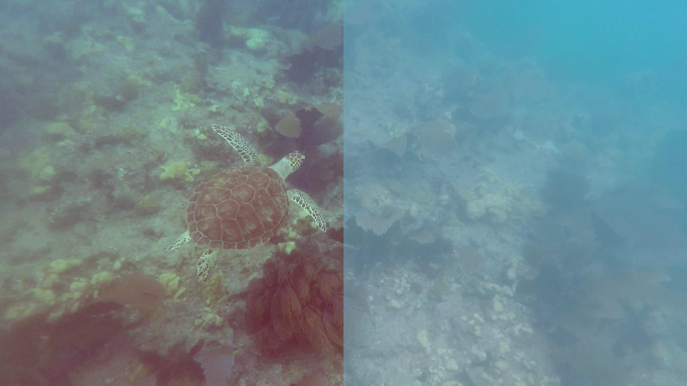

### Python Image Processing

Fixes underwater footage by sampling the first frame and finding the mean and standard deviation of the blue and green pixel intensities, then using these to correct the distribution of the pixel intensities in all frames to make video subjects more visible.

In the example image, the left half has been filtered using this method while the right side is the original frame of the video.

